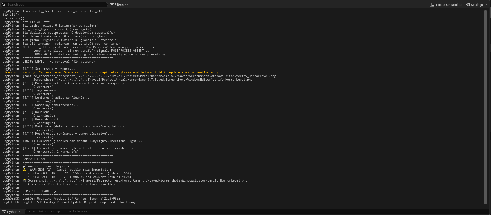
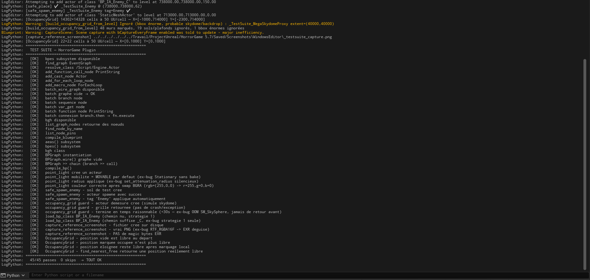

# UE5 Agent-Verified Level Generation

[](https://github.com/ThomasLabetouille/ue5-agent-verified-levelgen/actions/workflows/ci.yml)

**A C++/Python toolchain that lets an AI agent drive the Unreal Engine 5 editor
reliably: procedural geometry generation, scripted Blueprint editing, and
automatic verification (collisions, materials, NavMesh) before anything is
ever saved.**

Built as the tooling layer behind a solo horror FPS project in UE5.7.

---

## The problem

Letting an AI agent edit a 3D editor is a different kind of risk than letting
it edit text. An agent that acts "blind" inside Unreal Engine can spawn an
enemy inside a wall, "successfully" compile a Blueprint that crashes at
runtime, or nudge an asset it meant to leave alone. This project starts from
one rule: **an agent should never be able to commit a state that hasn't been
checked, visually and automatically.**

Everything below exists to turn "the agent ran some code" into "the agent
verified, both visually and automatically, that the result is correct."

## Architecture

```
┌─────────────────────────────────────────────────────────────┐
│  Agent interface                                             │
│  • In-editor "Claude AI" panel (C++/Slate, Anthropic API)     │
│  • MCP bridge (Claude Code / Claude agent → ue5_execute)      │
└───────────────────────────┬───────────────────────────────────┘
                             │ Python (IPythonScriptPlugin)
┌───────────────────────────▼───────────────────────────────────┐
│  RoomGenerator plugin (C++, Editor Subsystem)                 │
│  • RoomGeneratorSubsystem   — procedural geometry generation  │
│  • BlueprintEditingSubsystem — BatchWireGraph (JSON DSL)       │
│  • VignetteManager — runtime gameplay logic                   │
└───────────────────────────┬───────────────────────────────────┘
                             │
┌───────────────────────────▼───────────────────────────────────┐
│  Python toolchain (~4,500 lines)                               │
│  • safe_place / safe_spawn_enemy — zero-overlap placement      │
│  • verify_level — automatic level verification                │
│  • test_suite — anti-regression test suite for the plugin      │
│  • horror_presets — room/atmosphere templates                  │
└─────────────────────────────────────────────────────────────┘
```

## What makes the agent reliable (not just capable)

**Zero-overlap placement, in three layers.** `safe_spawn_enemy()` combines a
raycast floor-snap, a fast occupancy grid for pre-filtering, and a real
physics check via `sphere_overlap_actors`. An actor that would land inside a
wall gets repositioned to the nearest free space automatically — it's never
committed as-is.

**A DSL for wiring Blueprints without the usual 20+ API calls.**
`BatchWireGraph` takes an entire graph described as JSON (nodes + connections)
and wires it in a single C++ call, with pin-alias resolution and
case-insensitive fallback. It works around several undocumented UE5.7 editor
quirks along the way.

**Verification, not trust.** `run_verify()` scans automatically for: actors
intersecting geometry, missing floor under an actor, misconfigured lights,
missing gameplay tags, and a NavMesh that hasn't been rebuilt. The workflow
requires a screenshot + visual read after every level-design step — no
`save()` without a passing verification.

**An anti-regression test suite that runs in seconds.** Before and after any
C++ or Python change to the plugin, `test_suite.run_all()` validates every
subsystem (BlueprintEditingSubsystem, BatchWireGraph, BlueprintGraphHelper,
Python toolchain). A regression is caught before it ever reaches the level.

**Reliable synchronous screenshots.** Standard UE5 viewport screenshots are
queued for a future frame that sometimes never lands before the file is read
back — a diagnosed source of black or stale captures in agent-driven
workflows. `capture_reference_screenshot()` uses a `SceneCaptureComponent2D`
with a synchronous `capture_scene()` call instead, at a camera position the
agent chooses deliberately.

**Visual regression, not just structural pass/fail.** A level can pass every
structural check (no overlaps, no missing floor, correct tags) and still look
wrong — a moved light, a swapped material, a prop dropped by a refactor.
`Tools/visual_diff.py` promotes a verified-good screenshot to a per-zone
baseline and compares future rebuilds against it with a block-based SSIM
approximation in plain numpy (no `scikit-image` dependency). A low similarity
score doesn't auto-fail anything — it's a flag that something changed,
surfaced for a human/vision read rather than silently missed.

## Numbers

| | |
|---|---|
| C++ (plugin) | ~1,850 lines |
| Python toolchain | ~5,800 lines (+ ~800 lines of standalone QA/CI tooling in `Tools/`) |
| Automated tests | 81 in-editor (`test_suite.py`, run before/after any plugin change) + 9 editor-independent (`pytest`, this repo's CI) |
| Undocumented UE5.7 API quirks identified and worked around | 19 (see `docs/KNOWN_ISSUES.md`) |

## Stack

Unreal Engine 5.7 (C++, Slate UI) · Python (UnrealEditor Python API) ·
Anthropic API (Claude) for the in-editor agent panel · MCP for external agent
control · Behavior Trees & Blackboards (enemy AI) · Lumen/PostProcess (lighting)

## Status

Active solo project. The RoomGenerator plugin and the Python toolchain are
generic — reusable on any UE5 project that needs agent-driven level
generation or Blueprint editing.

## Proof, not just claims

`run_verify()` on the actual project level — automated checks, screenshot
included, before a single `save()` is allowed to happen:



The anti-regression suite for the plugin and Python toolchain (baseline
capture below is from an earlier pass at 45/45 — the suite has grown since,
see the Numbers table above for the current count; same suite, same
before/after diff logic):



---

*See `docs/ARCHITECTURE.md` for a deeper technical breakdown,
`docs/KNOWN_ISSUES.md` for the undocumented UE5.7 bugs found and fixed along
the way, and `docs/CI.md` for what the badge above actually checks (and, just
as deliberately, what it doesn't).*
